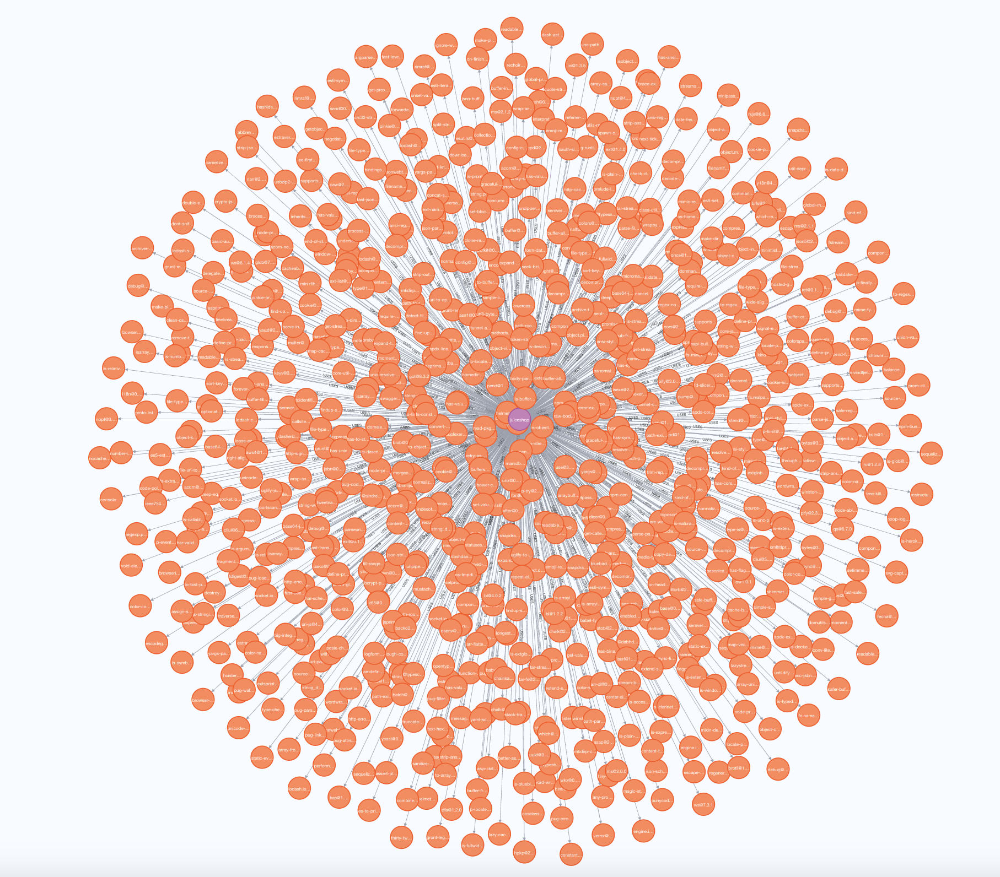

### Intro

I have usually struggled to find tools to visualise SBOMs from applications. Therefore, i decided to create a tool to cover that gap.

Neo4Cyclone is a project that ingests CycloneDX sboms in a Neo4J database for visualisation purposes

### How does it work?

The application itself is a parser that gets the relevant data from the CycloneDX report, and ingests that in a Neo4J database.

The easiest way to run it is via docker compose. It will start a docker image for Neo4J, and another one for Neo4Cyclone.

Neo4J can be accessed through the normal endpoint, http://localhost:7474/browser/

Neo4Cyclone requires three environmental variables:

- NEO4J_DB, which is the endpoint to ingest the data. By default it is neo4j://neo4j:7687
- NEO4J_USER, the user created in the Neo4J instance, the default user is neo4j
- NEO4J_PWD, the password for the user. Note that Neo4J requires to set the password during the first login.

The docker-compose.yml file is prepared to read that information from a .env file, but it can be modified to read from a different source

### How to ingest data?

Neo4Cyclone is listening by default on port 8080, although it can be changed in the docker compose configuration. 
This endpoint requires two parameters:
- project: the name of the project to be ingested in Neo4J
- file: the file that contains the CycloneDX SBOM

Here is an example on how to ingest that data:
```
 curl -X POST -H "Content-Type: multipart/form-data" -F "file=@juiceshop.json" -F "project=juiceshop" http://localhost:8080/
```

That call returns the summary of the action performed
```
{
  "Name": "juiceshop",
  "New dependencies added": 840,
  "New vulnerabilities added": 0
}
```
### Visualisations

The ingestion generates three different nodes, which are

- Project
- Dependency
- Vulnerability

It also generates two relations:

- Project-Uses->Dependency
- Dependency-Vulnerable_to->Vulnerability

Here is an example on how the juiceshop SBOM is displayed:




